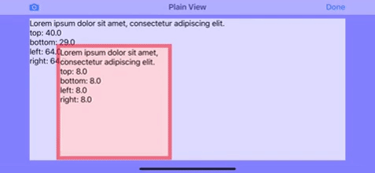

#  LayoutMarginsDemo

This project demonstrates UIKit's layout margins in action. 

Created by [Marina Gornostaeva](https://twitter.com/hybridcattt) for Detail-oriented UI with Layout Margins talk @ [NSSpain 2019](https://2019.nsspain.com). 

Recording: [Vimeo](https://vimeo.com/362202970) | Slides: [SpeakerDeck](https://speakerdeck.com/hybridcattt/detail-oriented-ui-with-layout-margins-at-nsspain-2019)

## About the project

Layout margin propagation is a really powerful thing. Try it out yourself!

A simple gesture recognizer changes the frame of the red view, 
showing how margins change when the subview is positioned close to the edge of its parent.

This behaviour can be enabled by setting `preservesSuperviewLayoutMargins` to `true` on your views. 

Requirements: Xcode 11, iOS 9.0+

## More

- [Notes from the margins](https://martiancraft.com/blog/2019/02/notes-from-the-margins/) by [Richard Turton](https://twitter.com/richturton)

- WWDC 2018 Session [UIKit: Apps for Every Size and Shape](https://developer.apple.com/videos/play/wwdc2018/235/) 

- [Adaptivity app](https://apps.apple.com/app/id1054670022) by [Geoff Hackworth](https://twitter.com/geoffhackworth)
